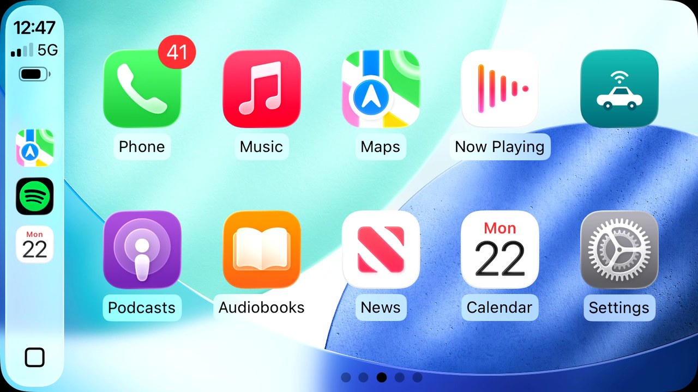

# carlinkit-cxx

A C++/libusb receiver for Carlinkit **"Auto Box" CarPlay/Android Auto dongles**
(USB `1314:1520` / `1314:1521`), with a zero-copy, hardware-plane video path:




```
dongle ──USB bulk──► libusb async DMA ring ──► H.264 ──► decode (VAAPI ▸ V4L2 M2M ▸ CPU)
                                                            │ NV12 (DMA-BUF; CPU copy on the software path)
                                                            ▼
                                              drm-cxx scene ──► HW overlay plane (KMS)
```

The phone connects to the dongle **wirelessly** (Wi-Fi + Bluetooth); nothing is
plugged into the dongle. See `docs/ARCHITECTURE.md` for the full design.

## Decode paths

H.264 from the dongle is decoded by one of three interchangeable backends (each
a `ck::DecoderSource` producing NV12 for the same KMS plane):

| Backend | When | How |
|---------|------|-----|
| **`vaapi`** | desktop / dev | libavcodec + VAAPI hwaccel → vendor-tiled NV12 **DMA-BUF**, scanned out zero-copy. |
| **`v4l2`** | embedded SoC (Rockchip, …) | drm-cxx's stateful V4L2 M2M decoder → NV12 DMA-BUF, no GStreamer. |
| **`software`** | anywhere (last resort) | libavcodec CPU decode + libswscale → NV12 in a DRM **dumb buffer**. Always works, but slow — prints a loud warning. |

`CARLINKIT_DECODER` picks the backend (`vaapi` / `v4l2` / `software` / `auto`,
default `auto`). **`auto` is the fallback chain: it tries VAAPI, then V4L2, then
software, and uses the first that opens.** Naming a specific backend pins it — if
that one fails to open, it's an error rather than a silent fall-through, so you
always know what you're running. Display rotation (`CARLINKIT_ROTATE`) is honored
on every path: VAAPI/V4L2 rotate on the HW plane, software rotates on the CPU.

Build with `-DCARLINKIT_SOFTWARE_ONLY=ON` to compile **only** the software
backend (drops the VAAPI/V4L2 sources and the libva link, for a smaller CPU-only
build). On distros with full ffmpeg (SteamOS/Arch, etc.) VAAPI works out of the
box; **Fedora needs two package swaps for hardware decode — see below.**

On the Raspberry Pi the backend follows the silicon: **Pi 5** has no hardware
H.264 decoder, so it uses `software`; **Pi 4**'s VideoCore VI has a V4L2 stateful
decoder, so it uses `v4l2`. The `.emb/` manifests set this per board — see
[Cross-compiling for Raspberry Pi](#cross-compiling-for-raspberry-pi-emb).

## ⚠️ Fedora setup (important)

Fedora ships Mesa **and** ffmpeg with the patent-encumbered H.264/H.265 codecs
**removed**. Without the swaps below the VAAPI backend can't open (Mesa exposes no
VA decoder; libavcodec exposes no VAAPI hwaccel), so `auto` falls through to the
**software** backend: you still get a picture, but it is CPU-decoded and slow,
with a loud `SOFTWARE DECODE WARNING`. Restore both for zero-copy hardware decode.

```bash
# 1. Enable RPM Fusion (free is enough for both fixes)
sudo dnf install -y \
  https://mirrors.rpmfusion.org/free/fedora/rpmfusion-free-release-$(rpm -E %fedora).noarch.rpm

# 2. Full Mesa VA drivers (adds H.264/H.265 *VA decode* to the radeonsi driver)
sudo dnf swap -y mesa-va-drivers mesa-va-drivers-freeworld

# 3. Full libavcodec (adds the H.264/H.265 *VAAPI hwaccel* to libavcodec)
sudo dnf install -y libavcodec-freeworld

# 4. Verify
vainfo | grep VAProfileH264          # expect: VAProfileH264High : VAEntrypointVLD
./build/carlinkit-decode-probe out.h264   # expect: "... zero-copy DRM-PRIME export OK"
```

`libavcodec-freeworld` overrides the stripped `libavcodec-free`. `vainfo` comes
from `libva-utils`. Non-Fedora distros with full ffmpeg/Mesa can skip all of this.

## Build dependencies

- `cmake` and `meson` (meson provisions drm-cxx's vendored deps), a **C++17**
  compiler (C++17 to match drm-cxx's ABI — C++20 selects `std::span` and
  mismatches drm-cxx's `tcb::span` symbols)
- `libusb-1.0` (`libusb1-devel`)
- `libavcodec` + `libavutil` + `libswscale` (`libavcodec-free-devel`,
  `libswscale-free-devel` — headers live in `/usr/include/ffmpeg`) for H.264
  decode and NV12 conversion; `libva` + `libva-drm` (`libva-devel`) for the VAAPI
  path
- KMS app: the **`drm-cxx`** git submodule at `third_party/drm-cxx` (pinned for
  reproducible builds; override with `-DDRM_CXX_DIR=/path` to build against a
  local working tree), `libdrm`, `libva` (unless `-DCARLINKIT_SOFTWARE_ONLY=ON`),
  and ALSA (`alsa-lib-devel`)

```bash
git submodule update --init --recursive    # fetch the drm-cxx submodule
cmake -S . -B build && cmake --build build  # configure provisions drm-cxx's meson subprojects

# CPU-only build (omits VAAPI/V4L2 and the libva link):
cmake -S . -B build -DCARLINKIT_SOFTWARE_ONLY=ON && cmake --build build
```

Targets: `carlinkit-probe` (headless capture), `carlinkit-decode-probe` (decode
check), `carlinkit-audio` (headless audio), `carlinkit-drm-dump` (DRM plane/mode
topology), and `carlinkit-kms` (the full head unit). The KMS app is built only
when `drm-cxx` + libswscale + libdrm are found (plus libva, unless
`CARLINKIT_SOFTWARE_ONLY`).

## Cross-compiling for Raspberry Pi (emb)

`carlinkit-kms` cross-compiles for 64-bit Raspberry Pi OS with
[emb](https://github.com/toyota-connected/emb_cli) using the manifests in `.emb/`. The
decode path is set per board to match the silicon: **Pi 5** is software-only (no
hardware H.264 decoder), **Pi 4** uses the V4L2 hardware decoder. Targets:
`rpi5-trixie`, `rpi5-bookworm`, `rpi4-trixie`, `rpi4-bookworm`.

```bash
# one-time: install the emb CLI and put it (and its Dart SDK) on PATH
eval "$(../emb_cli/bootstrap.sh --shellenv)"

git submodule update --init --recursive          # drm-cxx + its Vulkan-Headers
emb cross . --list-targets                        # show the Pi targets

# build carlinkit-kms and package a .deb for the Pi 5 (trixie):
emb cross . --target rpi5-trixie --build --deb
#  -> .config/.../dist/carlinkit-cxx_0.1.0_arm64.deb  (Depends auto-derived)
```

emb downloads the ARM GNU toolchain and the PiOS image, stages a sysroot from the
manifest's `dev_packages`, and builds drm-cxx + carlinkit against it (the large
toolchain/sysroot/build output lands under the git-ignored `.config/`).

Deploy + install on the Pi (emb's own `--deploy` is for Flutter bundles, so scp
this plain binary):

```bash
scp .config/.../dist/carlinkit-cxx_0.1.0_arm64.deb pi@raspberrypi.local:
ssh pi@raspberrypi.local 'sudo apt install -y ./carlinkit-cxx_0.1.0_arm64.deb'
```

Then install the dongle [udev rule](#usb-access-run-without-root) and run on a
console VT (Pi OS Lite has no compositor holding DRM master):

```bash
CARLINKIT_AUDIO_DEV=plughw:0,0 carlinkit-kms /dev/dri/card0 --no-seat
```

### Decode performance — Pi 4 vs Pi 5

The two boards take opposite paths: the **Pi 4** offloads H.264 to its VideoCore
hardware decoder (V4L2), while the **Pi 5** — which has no video-decode block —
decodes on the Cortex-A76 cores. Measured running live CarPlay at 1280x800
(`carlinkit-kms` process %CPU from `top`, of 400% = 4 cores):

|                      | Pi 4 — V4L2 HW decode          | Pi 5 — software decode      |
| -------------------- | ------------------------------ | --------------------------- |
| Decoder              | bcm2835-codec (`/dev/video10`) | libavcodec on the A76 cores |
| `carlinkit-kms` CPU  | ~6-10% of 4 cores              | ~15-20% of 4 cores          |
| SoC clock under load | stays at 600 MHz (idle)        | ramps to 2.4 GHz            |
| SoC temperature      | ~44 °C                         | ~54 °C                      |
| Display scanout      | 40-60 fps                      | 30-40 fps                   |

The Pi 4 barely touches the CPU — the decode runs in fixed-function hardware, so
the cores never leave their 600 MHz idle clock and the board stays cool. The Pi 5
does the same work on the CPU: it copes easily at 800p (the fast A76 ramps to full
clock), but the dongle's native 1280x1440 saturates it and crackles the audio, so
keep `CARLINKIT_RESOLUTION=1280x800` (or `1280x720`). Neither board pins a hard
60 fps — the residual is the vc4 KMS present path flipping a scaled NV12 plane,
not the render loop, which already commits non-blocking. There is no microphone
on either Pi, so Siri / phone-call input needs a USB mic (`CARLINKIT_MIC_DEV`);
HDMI audio output works as-is.

**Replicating the measurement.** On a console VT (no compositor) with the dongle
plugged and your phone paired:

```bash
# terminal 1: run CarPlay with decode/display fps + present timing logged
CARLINKIT_FPS_LOG=1 CARLINKIT_RESOLUTION=1280x800 \
  carlinkit-kms /dev/dri/card0 --no-seat

# terminal 2: process CPU (of 400% = 4 cores), SoC clock, and temperature
top -b -d 2 -p "$(pgrep -n carlinkit-kms)" | grep carlinkit-kms
vcgencmd measure_clock arm     # ~600 MHz (Pi 4, HW) vs ~2.4 GHz (Pi 5, SW)
vcgencmd measure_temp
```

`decoder:` at startup confirms the active path — `V4L2 (SoC HW decoder)` on the
Pi 4, `software (CPU H.264 -> NV12 dumb buffer)` on the Pi 5. The `[fps]` lines
report `video=` (the dongle's on-demand decode rate, which tracks what the phone
is drawing) and `display=` (KMS scanout).

## USB access (run without root)

The dongle's USB node is root-only by default. Install the udev rule for
non-root access (and so access survives the dongle re-enumerating) — either with
the helper, which re-execs itself with sudo and adds you to the rule's `dialout`
group:

```bash
./scripts/install-udev-rule.sh
```

or by hand:

```bash
sudo cp scripts/99-carlinkit.rules /etc/udev/rules.d/
sudo udevadm control --reload && sudo udevadm trigger --attr-match=idVendor=1314
sudo usermod -aG dialout "$USER"      # then re-login
```

The dongle also exposes a small USB mass-storage partition that auto-mounts at
`/run/media/$USER/APK`; unmount it before running (`umount /run/media/$USER/APK`).

## Run

```bash
# Headless capture: run init handshake, dump the CarPlay stream.
# Bring your iPhone near with Wi-Fi + Bluetooth on and accept CarPlay.
./build/carlinkit-probe                 # → out.h264 (H.264) + out.pcm (PCM audio)

# Verify the zero-copy HW decode path headlessly (no DRM master needed):
./build/carlinkit-decode-probe out.h264

# Headless audio (no display): play the dongle's PCM + capture mic.
./build/carlinkit-audio [playback-dev] [capture-dev]   # e.g. plughw:0,0

# Dump DRM plane/modifier/CRTC topology (read-only, no DRM master):
./build/carlinkit-drm-dump /dev/dri/card1
```

### The head unit (`carlinkit-kms`)

Full experience — live video on a HW plane + audio + touch/cursor. **Must run on
a free VT (Ctrl+Alt+F3) with DRM master**, not inside a desktop or over SSH (stop
your display manager first if needed: `sudo systemctl stop gdm`).

```bash
./build/carlinkit-kms /dev/dri/card1 --no-seat
# Pair your iPhone (Wi-Fi + Bluetooth on). Quit with Esc / Q / Ctrl-C.

# Inspect / pick a display mode (sets resolution, fps, and DPI together):
./build/carlinkit-kms /dev/dri/card1 --no-seat --drm-list-modes
./build/carlinkit-kms /dev/dri/card1 --no-seat --drm-mode 9        # by index
./build/carlinkit-kms /dev/dri/card1 --no-seat --drm-mode 1280x720 # or WxH[@R]
```

- **Video** fills the panel preserving aspect ratio via the HW plane scaler (zero
  CPU); letterboxes when the panel isn't 16:9. The panel's **native mode** is kept
  (forcing a non-native mode makes the monitor rescale and distort).
- **Audio** plays through ALSA (`"default"` → PipeWire when present); mic is
  captured on Siri/phone-call.
- **Touch / mouse** drive the CarPlay UI; a HW cursor follows the mouse.
- **Hotplug**: the dongle is auto-(re)connected; surprise removal is survived
  (the last frame stays on screen until video resumes).

Environment overrides:

| Var | Effect |
|-----|--------|
| `CARLINKIT_CONNECTOR=DP-1` | Target a specific display (e.g. `HDMI-A-1`, `DP-1`) |
| `DRM_FORCE_MODE=2560x1440` | Force a specific mode on the connector |
| `CARLINKIT_CRTC=<id>` | Force a CRTC (debug; see `carlinkit-drm-dump`) |
| `CARLINKIT_DECODER=auto` | Decode backend: `vaapi`/`v4l2`/`software`/`auto` (default `auto` = VAAPI ▸ V4L2 ▸ software). A named backend that can't open is a fatal error, not a fall-through |
| `CARLINKIT_V4L2_DEV=/dev/video0` | V4L2 decoder node; default = scan `/dev/video*` for an H.264 M2M decoder |
| `CARLINKIT_ROTATE=90` | Rotate the video `90`/`180`/`270°` (HW plane for VAAPI/V4L2, CPU convert for software) |
| `CARLINKIT_RESOLUTION=1280x720` | CarPlay/box resolution; default = the DRM mode (1:1, no scaling) |
| `CARLINKIT_AA_RESOLUTION=1280x720` | Android Auto canvas; default = the box resolution |
| `CARLINKIT_FPS=60` | Frame rate; default = the mode's refresh rate, capped at 60 |
| `CARLINKIT_DPI=160` | UI density; default computed from the panel's physical size, else 160 |
| `CARLINKIT_DRIVE_POSITION=left` | `left`/`right` (LHD/RHD); default `left` |
| `CARLINKIT_MEDIA_DELAY=300` | Audio/video sync compensation in ms (default 300) |
| `CARLINKIT_GNSS=0` | `GNSSCapability` bitmask advertised to the phone (default 0 = none; only set with a real GNSS feed) |
| `CARLINKIT_DASHBOARD=1` | `DashboardInfo`: offer the CarPlay Dashboard (default 1) |
| `CARLINKIT_BT_PHONE=0` | `UseBTPhone`: 1 routes calls via the car's Bluetooth instead of this link (default 0) |
| `CARLINKIT_HICAR=0` | `HiCarConnectMode` for Huawei HiCar (default 0) |
| `CARLINKIT_POINTER_GAIN=4` | Free mouse cursor speed multiplier (default 2.5) |
| `CARLINKIT_DRAG_GAIN=5` | Cursor speed while a button is held — swipes/flings (default 5.0) |
| `CARLINKIT_TOUCH_HZ=90` | Touch report rate while dragging; coalesces the mouse stream to a touchscreen-like rate so CarPlay flings register (default 90) |
| `CARLINKIT_AUDIO_DEV=plughw:1,3` | ALSA playback device (default `default`) — see Audio setup |
| `CARLINKIT_AUDIO_LATENCY_MS=120` | Playback buffer in ms; larger trades latency for fewer underrun clicks (default 120) |
| `CARLINKIT_MIC_DEV=plughw:2,0` | ALSA capture device for Siri / calls (default `default`) |
| `CARLINKIT_OEM_ICON=assets/logo.png` | PNG to set as the dongle's own launcher tile (sent on connect); unset = leave the dongle's default |
| `CARLINKIT_OEM_LABEL="carlinkit-cxx"` | Optional caption shown under the OEM icon |
| `CARLINKIT_CAPTURE_DIR=.` | Directory where `SIGUSR1` writes a raw NV12 screenshot of the current frame (default `.`) |
| `CARLINKIT_AUDIO_TRACE=1` | Debug: log the audio mixer's per-stream routing/ducking decisions |

> **Known issue:** on some AMD multi-display setups, drm-cxx's allocator rejects
> the decoder's tiled-NV12 modifier on one pipe (e.g. `DP-1`) even though the
> kernel advertises it on every CRTC (`carlinkit-drm-dump` confirms). Use the
> working connector for now.

### Audio setup

Audio plays through ALSA. The app opens the `"default"` PCM, which on a normal
desktop **PipeWire** session routes wherever your system audio goes — that just
works. But on a bare VT (PipeWire usually not running) or when your speakers are
on a non-default card, you must point the app at the right device with
`CARLINKIT_AUDIO_DEV`.

1. **List your playback devices** and find the card your speakers are on:

   ```bash
   aplay -l
   # card 0: Audio [USB Audio] ...        ← a USB DAC / headset
   # card 1: Generic [HD-Audio Generic], device 3: HDMI 0 [LG ...]   ← monitor over HDMI
   ```

   The ALSA name is `plughw:<card>,<device>` (the `plug` prefix lets ALSA convert
   sample rates, which the app's streams need). Examples: `plughw:0,0` (USB),
   `plughw:1,3` (the HDMI/monitor output above).

2. **Not sure which one has your speakers?** Play a test tone to each:

   ```bash
   speaker-test -D plughw:1,3 -c 2 -t sine -f 440 -l 1   # listen, Ctrl-C to stop
   ```

3. **Run with that device:**

   ```bash
   CARLINKIT_AUDIO_DEV=plughw:1,3 ./build/carlinkit-kms /dev/dri/card1 --no-seat
   ```

   Or test audio alone (no display, plays while the phone streams):

   ```bash
   ./build/carlinkit-audio plughw:1,3
   ```

**Muting:** `AudioOutput` clears the card's playback mute switches when it opens
the device, so a muted mixer (common on USB DACs) can't silence playback. If you
still hear nothing, check levels with `alsamixer -c <card>` (M toggles mute, up
arrow raises volume). To keep mixer state across reboots: `sudo alsactl store`.

**HDMI / DisplayPort audio** has no software volume (it is fixed; control it on
the monitor) and cannot capture, so route the mic (`CARLINKIT_MIC_DEV`) to a real
input — a webcam or USB mic — when you want Siri / phone calls.

## Status

- ✅ USB protocol + async DMA-ring receiver (`carlinkit-probe`)
- ✅ Decode backend chain (VAAPI ▸ V4L2 ▸ software) via `CARLINKIT_DECODER`
- ✅ libavcodec+VAAPI H.264 → zero-copy NV12 DMA-BUF (`carlinkit-decode-probe`)
- ✅ Software (CPU) H.264 → NV12 dumb-buffer fallback (`CARLINKIT_DECODER=software`)
- ✅ drm-cxx KMS video sink on a HW plane (`carlinkit-kms`) — aspect-fit, native mode
- ✅ Display rotation on every path (HW plane for VAAPI/V4L2, CPU for software)
- ✅ ALSA audio out + mic; touch + mouse cursor input
- ✅ Hotplug / surprise-removal (auto-reconnect)
- ✅ Non-blocking present (`DRM_MODE_ATOMIC_NONBLOCK`) + `CARLINKIT_FPS_LOG` profiling
- ✅ Raspberry Pi 5 cross-compile via emb (`.emb/`) — validated end-to-end on hardware (software decode, HDMI audio, CarPlay)
- ✅ Raspberry Pi 4 V4L2 hardware-decode path — validated end-to-end on hardware (bcm2835-codec → zero-copy KMS, dongle + CarPlay; ~6-10% CPU at 600 MHz). DP-1 plane allocation still to fix.
